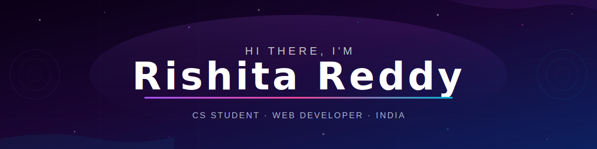
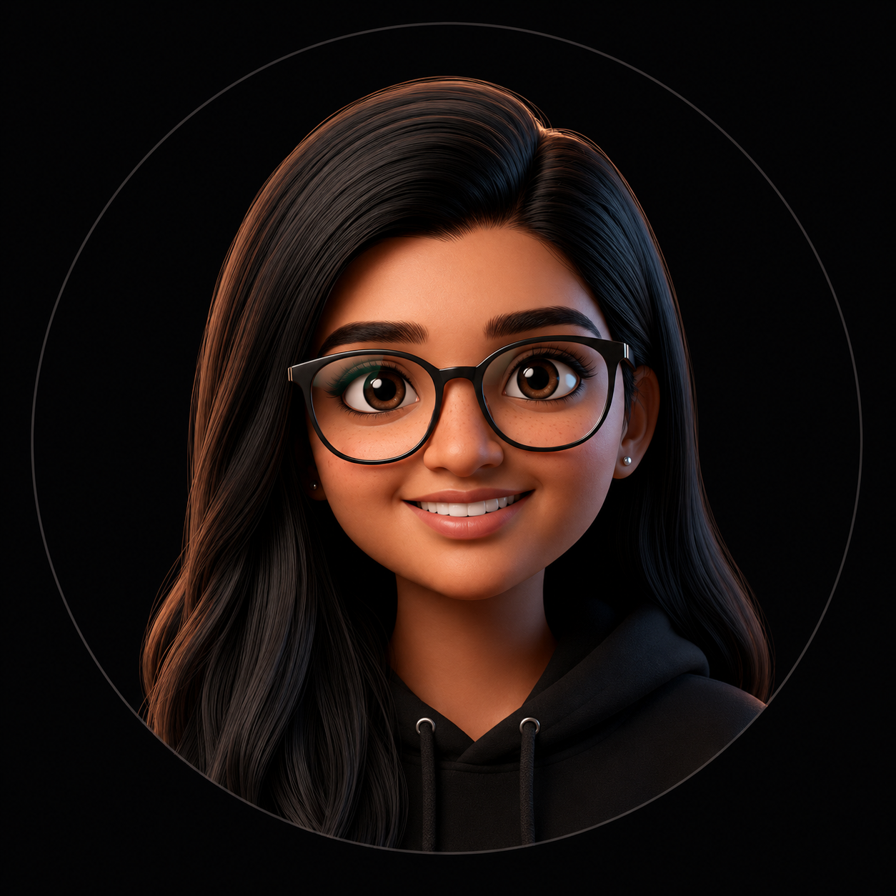

  

 

  
  &nbsp;
  
  &nbsp;
  
  &nbsp;
  

 

  

 

  <b>Building real-world web projects &nbsp;·&nbsp; Learning full stack development &nbsp;·&nbsp; Leveling up every day</b>

  
  
  

---

  

---

## 🧑‍💻 About Me

<table>
<tr>
<td valign="top" width="58%">

- 🎓 **CS Student** passionate about turning ideas into real web products
- 🌐 Built **Allien** — a complete movie & event ticket booking platform
- 💻 I build web apps with **HTML5, CSS3 & Vanilla JavaScript**
- ☕ Learning **Java** and **Python** for algorithms & backend logic
- 🎨 I care about clean UI, responsive design & smooth UX
- 🐧 Comfortable working on **Windows** & **Ubuntu**
- 🚀 Currently exploring full-stack web development
- 💬 Ask me about **HTML, CSS, JavaScript, Java, Python**
- 📫 Reach me at **rishireddy696@gmail.com**

</td>
<td valign="top" width="42%" align="center">
  
</td>
</tr>
</table>

---

## 🛠️ Top Skills

  

---

## 🧰 Tech Stack

  
  
  
  
  
  
  
  
  
  
  
  

---

## 🚀 Featured Project

| Project | Description | Tech |
|---|---|---|
| 🎬 [**Allien — Movie Ticket Booking**](https://github.com/Rishi6688/Movie-Proejct) | Full ticket booking platform — browse movies, watch trailers, pick seats on a 100-seat interactive grid, and checkout with payment & promo codes. Zero dependencies. | HTML5 · CSS3 · JS |

---

## 📊 GitHub Analytics

  
  
  
  

 

  
  &nbsp;&nbsp;
  

 

  

---

## 📈 Contribution Activity

  

---

## 🐍 Contribution Snake

  <picture>
    <source media="(prefers-color-scheme: dark)"  srcset="https://raw.githubusercontent.com/Rishi6688/Rishi6688/output/github-contribution-grid-snake-dark.svg"/>
    <source media="(prefers-color-scheme: light)" srcset="https://raw.githubusercontent.com/Rishi6688/Rishi6688/output/github-contribution-grid-snake.svg"/>
    
  </picture>

---

## 🤝 Connect With Me

  
  
  

---

  

  ⭐ Star my repositories if you find them useful!

